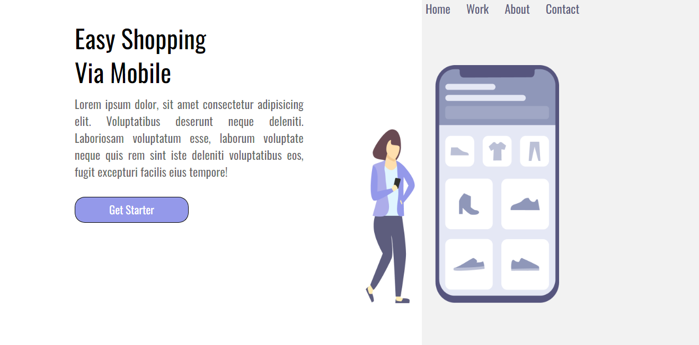
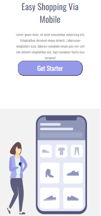

# Via-Mobile

Project developed for learning practice with work in CSS and HTML.
Check it out, help it grow!

These are the results:

<table>
  <tr>
    <td align="center">
      <a href="#">
         
        
          <b>Rafael Martins</b>
        
      </a>
    </td>
    
  </tr>
</table>
